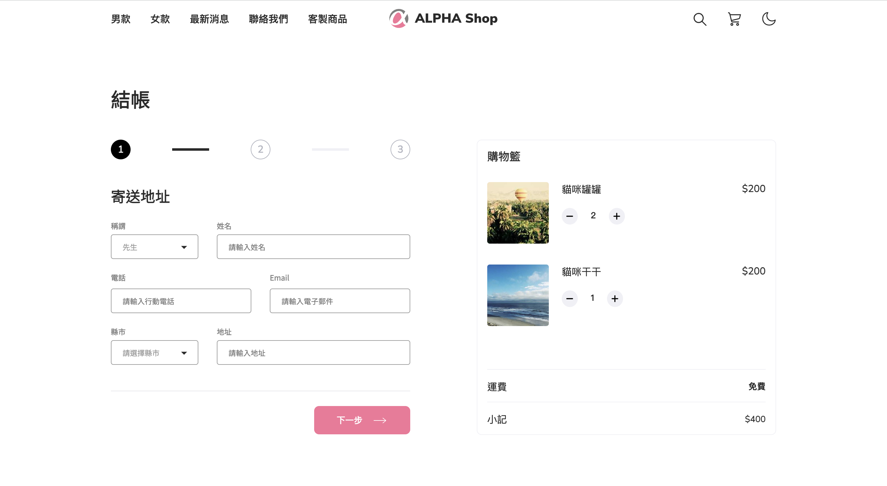
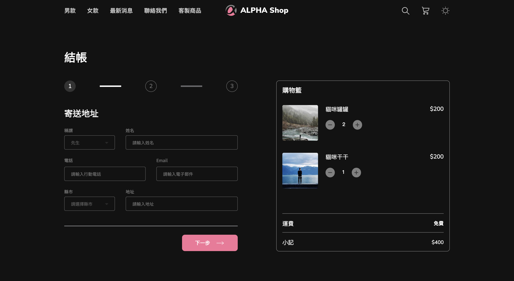

# Alpha Shop

## 介紹
簡易的購物車系統。




## 功能
- 目前只有靜態畫面

## 開始使用
1. 請先確認有安裝 node.js 與 npm
2. 將專案 clone 到本地
3. 在本地開啟之後，透過終端機進入資料夾，輸入：
```
npm install
```
4. 安裝完畢後，繼續輸入：
```
npm start
```
5. 打開瀏覽器進入到以下網址：
```
http://localhost:3000
```
6. 若欲暫停使用
```
ctrl + c
```
## 開發工具
- node.js 16.18.0
- react 18.2.0
- sass 1.26.7